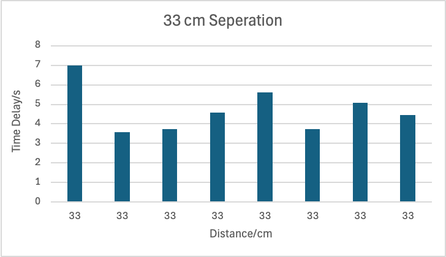
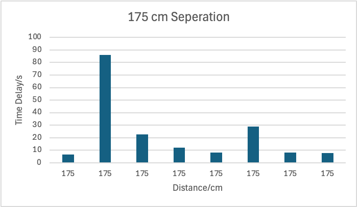
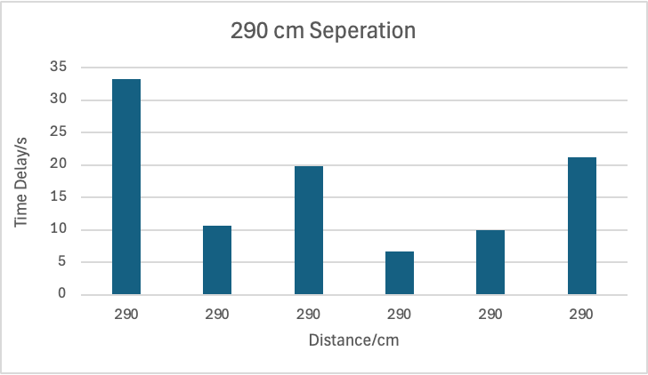
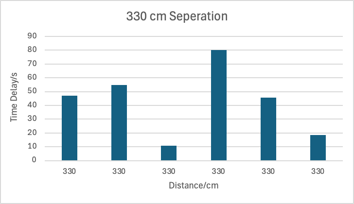

# Drone Detection
<video src="./Working_Example.mp4" controls="controls" width="100%">
    Your browser does not support the video tag.
</video>

## Aalborg Univeristy, AIE-2 project
THANK YOU to Christian Mai and Fredrik F. Sørensen, for their guidance throughout this project.
 THANK YOU to [Yash](https://github.com/yashlancers/mm_Wave_Radar_IWR6843AOPEVM), his IWR code is the initial version of radar.py
 THANK YOU to [Alireza0K](https://github.com/Alireza0K/Unmanned-Aerial-Vehicle) for his open-sourced yolo-v8 detection model\
 Author: Yang Kunyuan(me), Maté Papp, Douglas Takle

## Python Environment: 
Interpreter: Python 3.8
 ultralytics==8.4.37
 pyserial==3.5
 scikit-learn==1.3.2

## Keyword
Ti IWR6843AOPEVM
 Yolov8 Model Implementation
 Arduino's Junior Project
 Drone Detection

## Target User: 
bachelor or high school student who is interested in AI's implementation and Arduino
 WE PROVIDE A DETAILED EXPLAINATION FOR EACH COMPONENT:
 https://www.overleaf.com/read/yjyrxjvpsxby#cf75ce
 Chapter 4,5,6 are STRONGLY RECOMMENDED to read if you are the beginner

## Device List: 
Ti IWR6843AOPEVM - can change to other radar, need to edit radar.py if the format is insame 
 HC-SR04 Ultrasonic Sensor
 Arduino Uno R3
 FIT0458 Motor with Encoder - encoder will not be used
 L298N Motor Driver - NECESSARY if you don't want to burn your Arduino
 Common Anoder RGB LED - Cathode is okay too, but you need to change AnalogWrite in LED_show() in Arduino.ino
 Light Dependent Resistor
 Jetson Nano - Raspaberry Pi is okay too

## Testing Performance: 
NOTE: Distance here is Horizontal Distance, Vertical Distacne is varying
 
 
 
 

## 3D printing

## If question
feel free to contact me, Yang, (fy14pi@student.aau.dk)